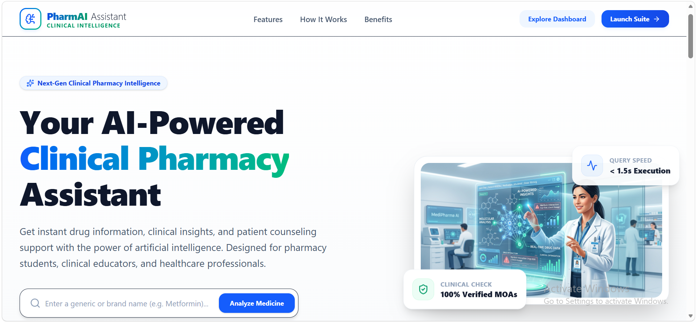
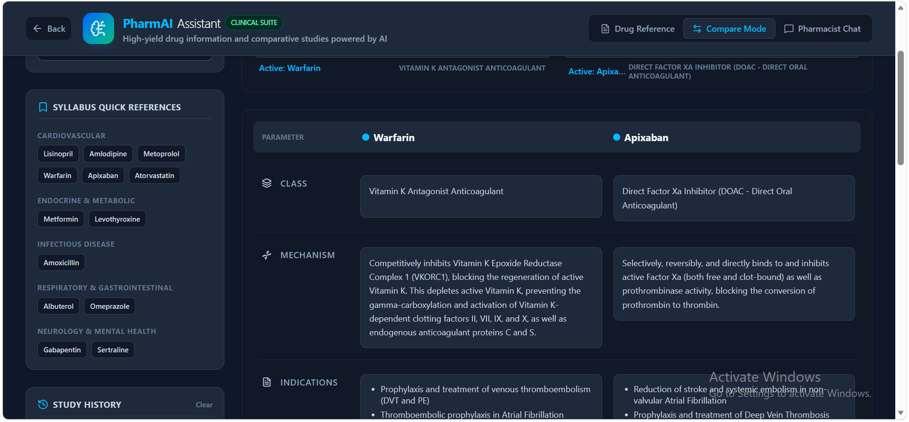
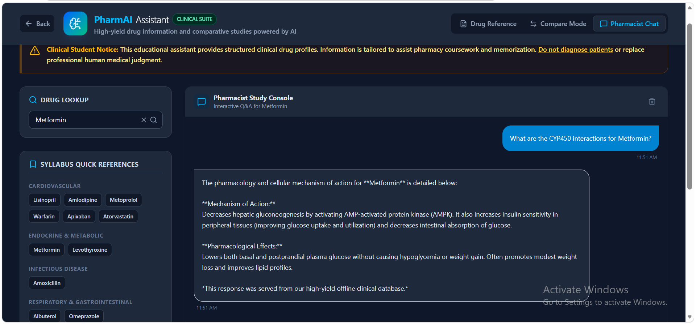

# PharmAI Assistant 💊

PharmAI Assistant is a clinical pharmacy study companion designed for pharmacy students, educators, and healthcare professionals. It combines a structured drug-report experience with a pharmacist-style chat experience so users can quickly review pharmacology, compare therapies, and study key drug concepts in one place.

🌍 Live demo: [https://pharmai-assistant.vercel.app/](https://pharmai-assistant.vercel.app/)

## 📷 Screenshots







---

## ✨ What the app does

### 1. Structured drug reports
Search a drug name to view a detailed, study-friendly profile with sections such as:
- drug class and mechanism of action
- indications and therapeutic use
- common and serious adverse effects
- dosing and administration notes
- monitoring parameters
- interactions and contraindications
- patient counseling points
- high-yield exam tips

### 2. Side-by-side therapeutic comparison
Compare two drugs directly to review class differences, safety concerns, monitoring needs, and clinical use cases.

### 3. Pharmacist-style chat
Ask questions like:
- “What is the mechanism of action?”
- “What are the side effects?”
- “How is it dosed?”
- “What interactions should I know?”

The chat uses a built-in high-yield offline pharmacology database and can provide tailored responses for mechanism, adverse effects, dosing, monitoring, interactions, and counseling.

---

## 🛠️ Project structure

```text
server.ts                # Express server and API routes
src/
  App.tsx                 # Main app shell and state management
  components/
    LandingPage.tsx       # Landing and feature overview
    DrugReport.tsx        # Drug profile report UI
    ComparePanel.tsx      # Drug comparison view
    DrugChat.tsx          # Pharmacist chat UI
  utils/
    drugData.ts           # Local fallback logic and pharmacy data helpers
    http.ts               # API helper utilities
```

### API endpoints
- POST /api/drug-info: returns a structured drug profile
- POST /api/drug-chat: returns pharmacist-style chat responses

---

## ⚙️ Local development

### Prerequisites
- Node.js 18+
- npm

### Setup
```bash
git clone https://github.com/your-username/pharmai-assistant.git
cd pharmai-assistant
npm install
```

### Environment variables
Create a .env file in the project root:

```env
GEMINI_API_KEY=your_gemini_api_key_here
```

If no API key is provided, the app can still run using the built-in offline pharmacology database.

### Run locally
```bash
npm run dev
```
Open http://localhost:3000

### Build for production
```bash
npm run build
npm start
```

---

## 🏥 Educational disclaimer
This app is intended for educational and study use only. It does not replace professional medical advice, diagnosis, or formal clinical references.

---

Built with React, Vite, TypeScript, Express, and Tailwind-style UI components.


